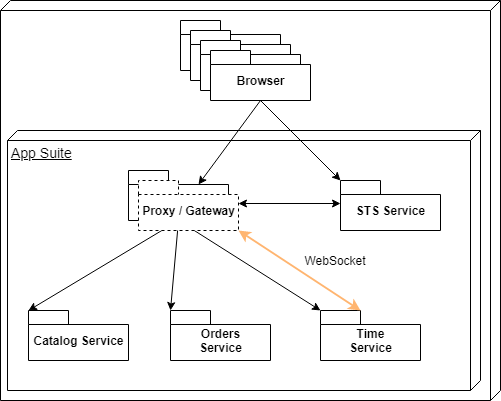

# Software Requirements Specification

| Release | Date       | Author           | Reviewer         |
| ------- | ---------- | ---------------- | -----------------|
| 1A      | 04.08.2020 | Thomas Duft      | -                |


**Table of Contents**

[[_TOC_]]

## Introduction

The requirements specification contains the use cases, the logical data structures of the system
interfaces as well as the physical system interfaces, the quality characteristics and the essence of
the information and sequences to meet the required functionality.

## Definitions

### Natural language requirements

The requirements written in natural language are recorded accordingly to the following template.

```
Identification    Name

Description

Weight    Source stakeholder    Author
```

Weight: Shall, Should, May

FR-xxx identifies a functional requirement.
QC-xxx identifies a quality characteristic or a non-functional requirement.

### Stakeholder

|  Id  | Representative            | Role                                    | Domain      |
| :--: | ------------------------- | --------------------------------------- | ----------- |
| SH01 | Thomas Duft               | System Architect                        | Development |


## Glossary

|      |      |
| ---- | ---- |
|      |      |
|      |      |
|      |      |
|      |      |
|      |      |
|      |      |
|      |      |
|      |      |
|      |      |

## Overall description

This repository consists of the following applications:
- Frontend: contains the applications ui
- Gateway: provides as the applications api gateway and hosts the frontend.
- Time: provides as the applications time services and uses websockets to push the current time to the frontend
- Catalog: provides a simple catalog api that requires authentication
- Orders: provides a simple orders api that requires authentication


### System context



### System functionality

tbd

## Use case specification

tbd


## Functional requirements
\-


## Quality characteristics

### Usability
\-

### Reliability
\-

### Maintainability
\-

### Security
\-


## Boundary conditions
\-
